# Modul 4 (DNS)
Domain Name System (DNS) merupakan komponen penting dalam infrastruktur internet yang berfungsi mengubah nama host menjadi alamat IP. Pada modul ini, fokus pembahasan akan diarahkan pada sisi klien DNS. Perlu dipahami bahwa peran klien dalam sistem DNS cukup sederhana, yaitu hanya mengirimkan permintaan ke server DNS lokal dan kemudian menerima jawaban yang diberikan.

## Modul 4.2 Nslookup
nslookup merupakan sebuah perintah atau alat yang digunakan untuk memperoleh serta menampilkan informasi yang berkaitan dengan Domain Name System (DNS). Tool ini dapat digunakan untuk mengetahui alamat IP dari suatu domain maupun sebaliknya, sehingga sangat membantu dalam proses pengecekan jaringan serta analisis atau troubleshooting koneksi.

## Langkah - Langkah percobaan
1. Jalankan Command Prompt (cmd) pada perangkat yang digunakan, kemudian masukkan perintah "nslookup www.mit.edu
" dan tekan ENTER. Perintah ini digunakan untuk mengetahui alamat IP dari domain tersebut.
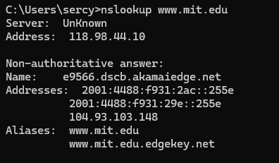

2. Buka Command Prompt (cmd), lalu ketik perintah "nslookup -type=NS mit.edu" dan tekan ENTER. Perintah ini digunakan untuk menampilkan daftar Name Server (NS) yang menangani domain tersebut.
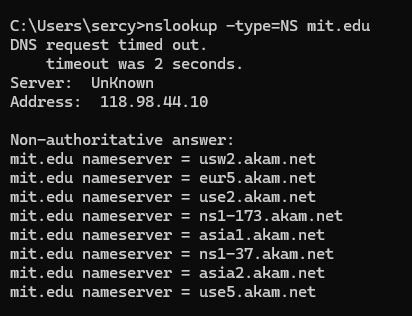
 
3. Buka Command Prompt (cmd), kemudian ketik perintah "nslookup www.aiit.or.kr
 bitsy.mit.edu" dan tekan ENTER. Perintah ini digunakan untuk meminta informasi alamat IP domain www.aiit.or.kr
 dengan menggunakan server DNS bitsy.mit.edu sebagai sumber pencarian.
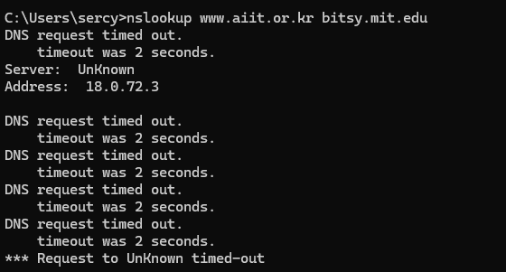

## Pertanyaan
1. Mencari IP server web di Asia
Perintah : nslookup www.u-tokyo.ac.jp
Domain : www.u-tokyo.ac.jp
Alamat IP : 210.152.243.234
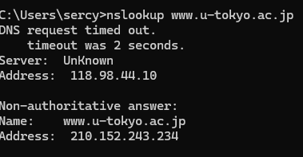

2. Mencari DNS otoritatif universitas di Eropa
Perintah : nslookup -type=NS cam.ac.uk 
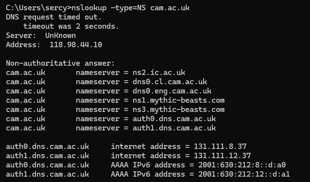

3. Mencari mail server Yahoo melalui DNS tertentu
Perintah : nslookup -type=MX gmail.com dns0.cam.ac.uk
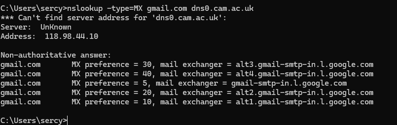

# Modul 4.3 Ipconfig
ipconfig merupakan perintah yang tersedia pada sistem operasi Windows untuk melihat serta mengatur konfigurasi jaringan pada komputer. Melalui perintah ini, pengguna dapat mengetahui informasi seperti alamat IP, subnet mask, dan default gateway, sehingga memudahkan dalam memahami kondisi serta pengaturan koneksi jaringan yang sedang aktif.

## Langkah - Langkah Percobaan
1. Buka Command Prompt (cmd), kemudian ketik perintah "ipconfig /all" dan tekan ENTER. Perintah ini digunakan untuk menampilkan informasi lengkap konfigurasi jaringan pada laptop, termasuk alamat IP dan DNS yang digunakan.
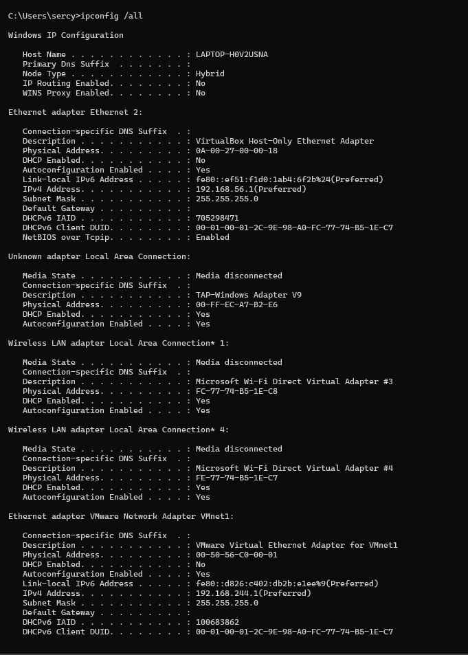

3. Buka cmd lalu ketik "ipconfig /displaydns" lalu ENTER. Fungsinya untuk menampilkan dns
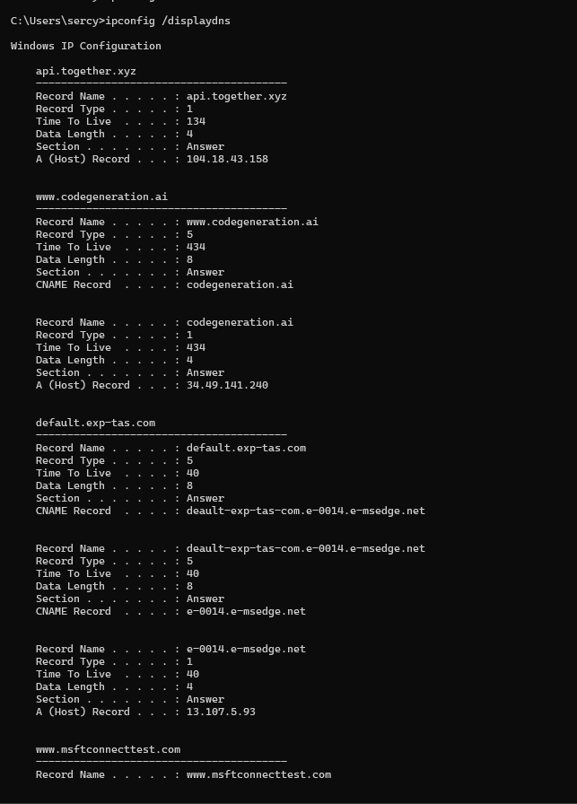

4. Buka cmd lalu ketik "ipconfig /flushdns" lalu ENTER. Fungsinya untuk menghapus dns yang sudah di buka dalam device yang di gunakan
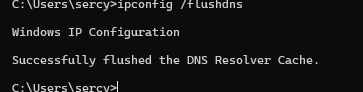

# 4.4 Tracing DNS dengan Wireshark

Mempelajari cara memantau serta menganalisis paket data DNS yang dikirim dan diterima oleh komputer melalui jaringan, sehingga pengguna dapat memahami bagaimana permintaan pencarian domain (DNS query) dikirim ke server dan bagaimana balasannya diterima. Hal ini berguna untuk memahami mekanisme kerja DNS serta membantu dalam proses analisis dan troubleshooting jaringan.

# A. Analisis DNS Request dan Response pada Akses Website (www.ietf.org)

## Langkah - Langkah Percobaan
1. Buka cmd lalu ketik "IPCONFIG" untuk melihat IP lalu copy IP pada laptop masing-masing. lalu buka wireshark
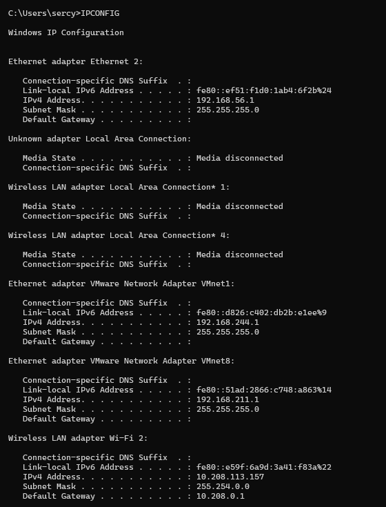

2. Setelah buka wireshark pilih jaringan yang digunakan (saya menggunakan wifi). Setelah memilih wifi click bagian filter lalu ketik ip.addr == (sesuai hasil di cmd)
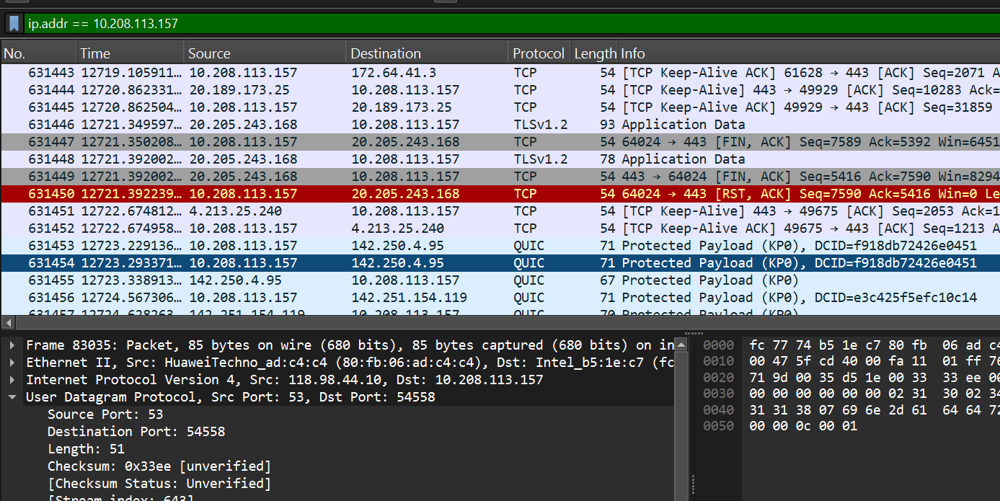

3. Buka browser http://www.ietf.org/

4. Tambahkan filter lagi ip.addr == 10.218.11.201 && dns.qry.name contains "ietf" 
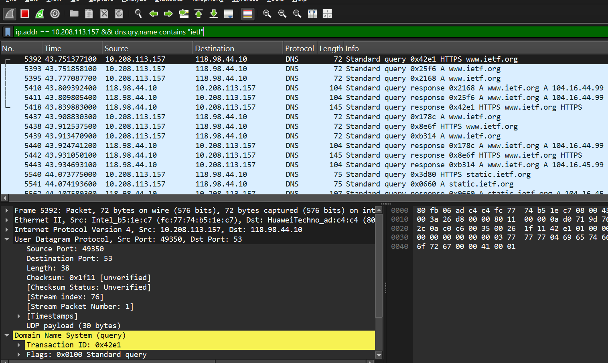

## Pertanyaan
1. Apakah DNS menggunakan UDP atau TCP?
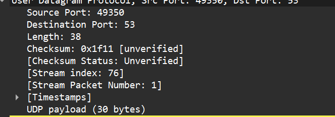

Dari percobaan yang di lakukan terilhat bahwa DNS menggunakan UDP

2. Port tujuan pada DNS request & port sumber pada DNS response

# B. Analisis DNS Menggunakan Perintah nslookup (www.mit.edu)

## Langkah - Langkah percobaan
1. Buka CMD ketikan perintah nslookup www.mit.edu
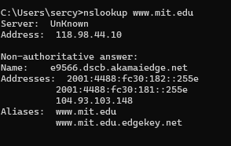

2. Buka wireshark lalu pilih jaringan yang digunakan, setelah itu pada bagian filter ketik DNS 
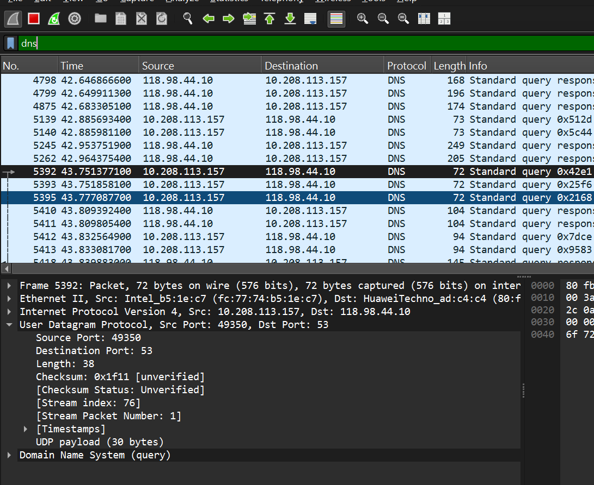

## Pertanyaan
 1. Port tujuan request dan port sumber dari response

- DNS request = destination: 53
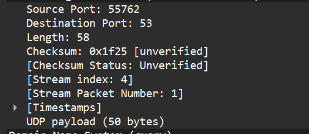

- DNS response = Source: 53
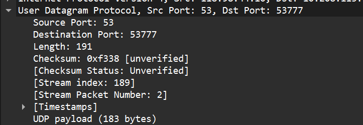

2. Alamat IP request
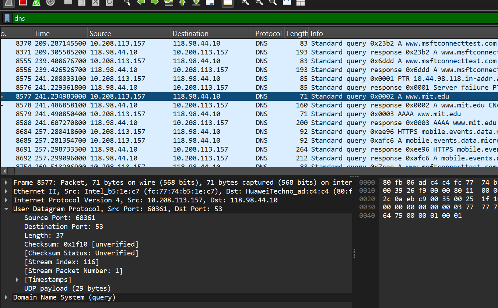

3. Type dan answer request
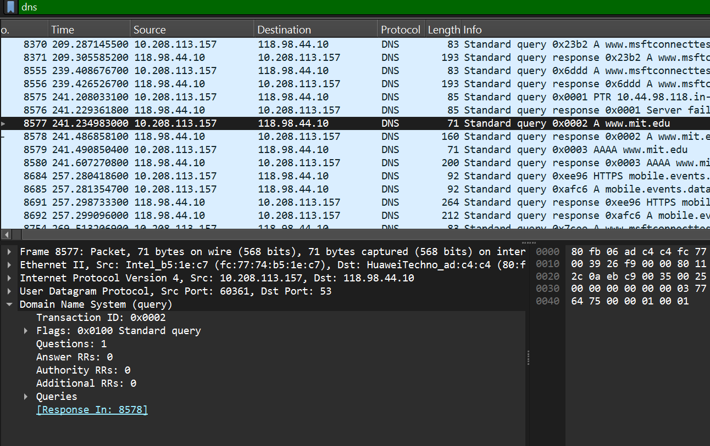

Pada percobaan yang dilakukan, terlihat bahwa type yang muncul adalah AAAA (IPv6 Address record) yang berfungsi untuk mencari alamat IPv6 dari suatu domain.
Pada paket nomor 13053, sumber 10.39.2.48 mengirimkan permintaan ke 10.39.2.148 dengan query AAAA www.google.com.
Pesan ini tidak mengandung jawaban karena masih berupa permintaan (query) untuk mencari alamat IPv6 dari domain www.google.com.

# C. Analisis DNS Record NS Menggunakan nslookup (mit.edu)

## Langkah - Langkah Percobaan
1. Buka CMD ketikan perintah nslookup -type=NS mit.edu
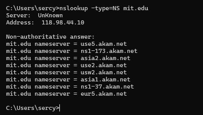

2. Buka Wireshark lalu pilih wifi, setelah itu pada bagian filter ketik dns untuk memunculkan bagian dns saja
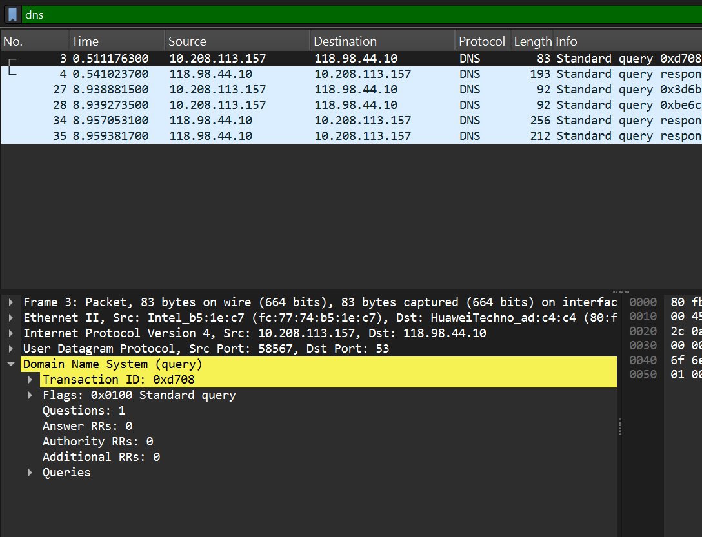

3. Ambil data dari Standard query (request) dan Standard query response dari NS mit.edu

## Pertanyaan 
1. Alamat IP request

2. Type dan answers request
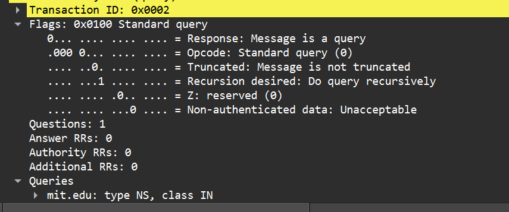

Pada percobaan bisa terlihat bahwa Type request dari DNS adalah NS yang artinya tidak mengandung jawaban karena hanya permintaan

3. Answer Response
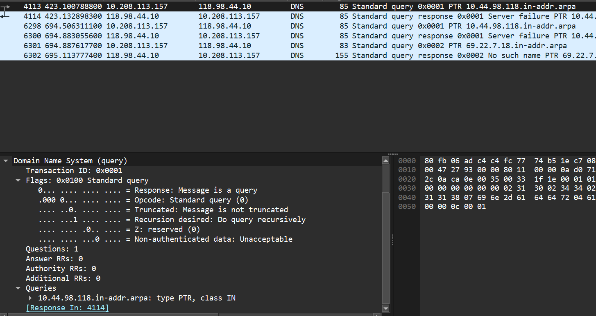

# D. Analisis DNS Menggunakan Server Tertentu (www.aiit.or.kr bitsy.mit.edu)

## Langkah - Langkah Percobaan
1. Buka CMD ketikan nslookup www.aiit.or.kr bitsy.mit.edu
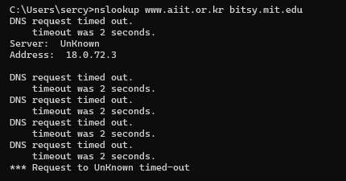

2. Buka Wireshark lalu pilih wifi, setelah itu pada bagian filter ketik dns untuk memunculkan bagian dns saja
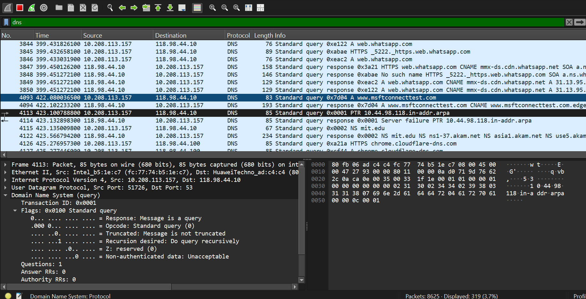

3. Ambil data dari Standard query (request) dari www.aiit.or.kr
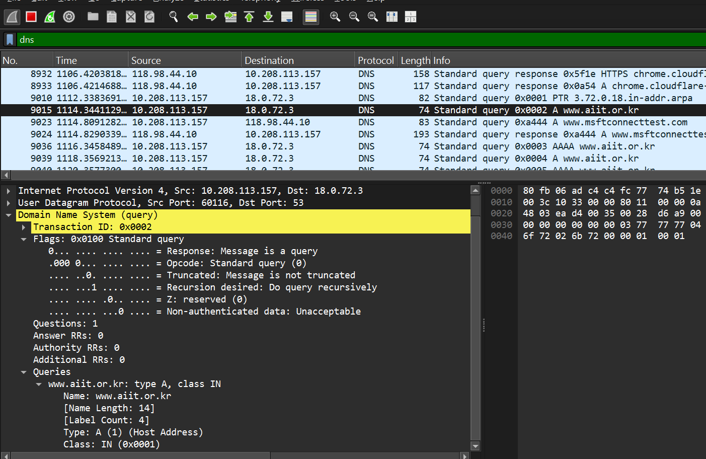

## Pertanyaan
1. Alamat IP request

2. Type dan answers request
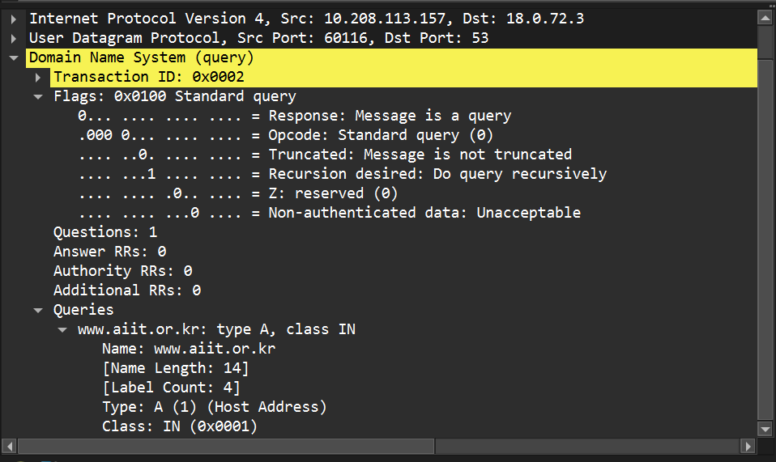

Tipe DNS request adalah A (Address Record). Pesan ini tidak mengandung jawaban karena hanya berupa permintaan

3. Answers response Berdasarkan hasil pada Command Prompt, terlihat bahwa terjadi “DNS request timed out”, yang menunjukkan bahwa server DNS tidak merespon permintaan yang dikirimkan
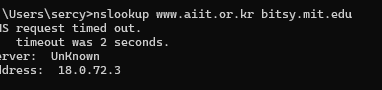